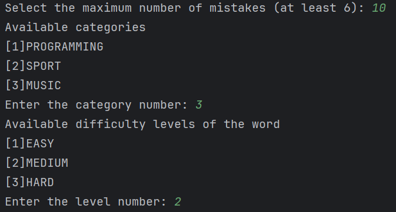
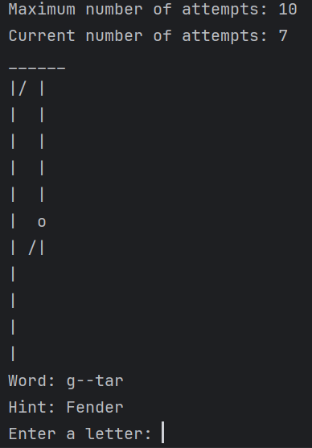
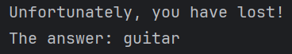
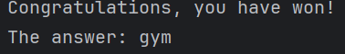

# Проект №1. Игра "Виселица"

Приложение представляет собой консольный вариант классической игры "Виселица"

# Особенности игры
 - **Выбор категории** - пользователь может выбрать категорию отгадываемого слова (Музыка, Программирование, Спорт)
 - **Выбор количества допустимых ошибок**
 - **Выбор уровня сложности** - представлены 3 уровня сложности слов (EASY, MEDIUM и HARD)
 - **Автоматический выбор категории и уровня сложности**, если пользователь пропустил ввод

## Ход игры
 - После запуска программы пользователю будет предложено выбрать количество
    допустимых ошибок, одну из 3 категорий вопросов и уровень сложности

    
 - Далее пользователь начинает игру, последовательно вводя буквы. 
    В случае затруднений можно использовать подсказку (ввести знак '-')
    
    

## Результаты 
 - Если пользователь потратил все попытки, система выводит
    сообщение о проигрыше, а также загаданное слово
    
    
 - Если пользователь отгадал слово выводится соответствующее сообщение
    
    

# Особенности реализации
 - Приложение написано на Java 22 с использованием системы сборки Maven
 - Для сохранения состояния игры (конфигурация, игра, результаты) используется паттерн *Стратегия*
 - Для хранения слов используется in-memory вариант в виде словаря

# Установка и запуск
Для установки приложения склонируйте проект
```shell
git clone git@github.com:salex06/Hangman.git
```
Наиболее удобным вариантом является запуск в IDE, например Intellij Idea.
Откройте проект и запустите приложение. Готово!
